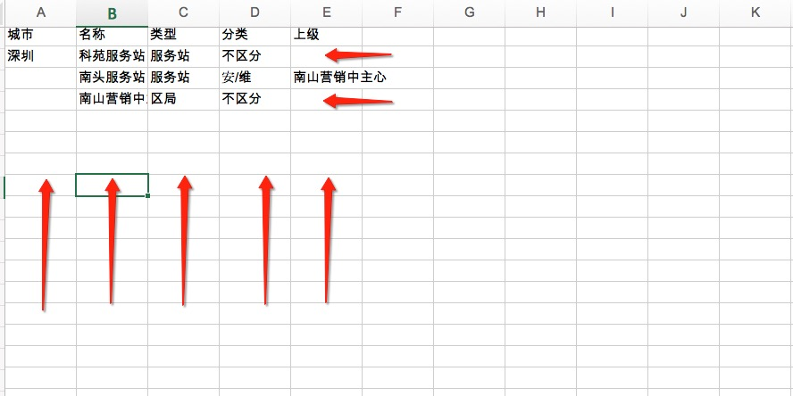
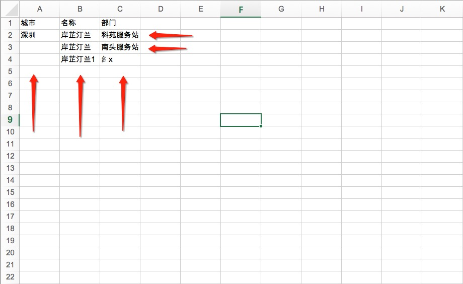
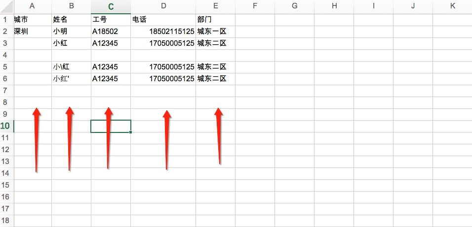

Excel转yml
==================

1 部门

注意: 表头必需一致，不要自由发挥

注意: 名称，类型， 分类必需有， 上级可以留空 留空表示在城市下级, 请求属于城市下级的部门放到前面

注意：如果上级部门不存在，可能也会属于城市下级，导致树行结构有问题， 

注意：类型  （取值范围  行政，服务器， 区局 等等， 与后台一致， 不要自由发挥）

注意：分类  （取值范围  不区分， 安/维,  营/宣 等等， 与后台一致， 不要自由发挥）

2 社区

注意: 表头必需一致，不要自由发挥

注意：名称， 部门必需要有 一个名称对应多个服务站，就放多行 如果名称， 部门没有值，这行被忽略

3 员工

注意: 表头必需一致，不要自由发挥

注意：姓名 工号 必需有， 如果姓名 工号没有值， 这行被忽略

注意：如果部门不存在， 则此人归属到城市

4 通过以下URL进行转换

http://220.115.251.49:99/

5 因为excel数据可能会有特殊字符，所在转换后的yml文件，通过以下URL进行校对，无格式问题即可

http://220.115.251.49:88/
